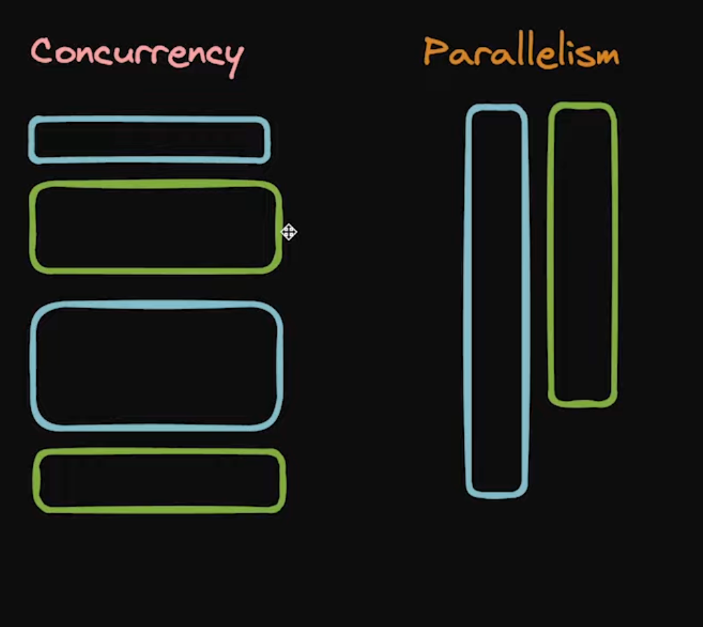
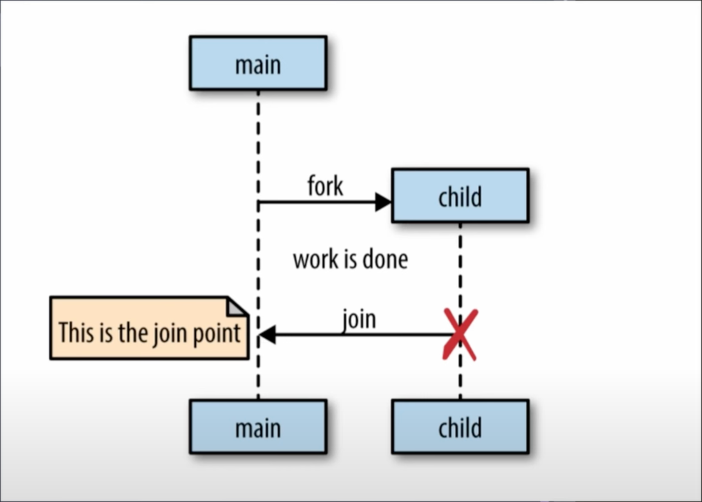

## Concurrency vs Parallelism

## Concurrency Terms
### GoRoutines
A goroutine is basically a concurrency concept in go that golang provides explicitly for users for fast processing of data in a concurrent manner. A main function also is overall a goroutine. Here's how it works internally:

### WaitGroup
A waitgroup is basically a variable that is defined to wait for a goroutine to end. A waitgroup must specify how much goroutines to wait for. A waitgroup must be asked to wait for the goroutines to end. A done func is also required to call over a waitgroup whenever the goroutine task is executed.

### Channel
A channel is a data structure (a kind of queue) that is used to pass and receive the messages and communicate between the goroutines. <- operator is used to pass msg into the channel and also used to read the values from a channel. A channel follows a by default synchronised FIFO structure. A channel if keeps waiting to send or receive msg without any condition can give deadlocks. Hence, it must be closed before that.

#### Unbuffered Channel
A channel with no capacity and that allows synchronised communication such that sender is blocked till msg received and receiver is blocked till sender sends.

#### Buffered Channel
A channel with capacity and that allows Async communication such that sender doesn't block until full and receiver doesn't block till buffer empty.

#### Close()
A close function will unblock the channel and make it closed for sending. Future send operations will give a panic (more precisely a deadlock) and future receive operations will receive the data till all values are read.

### Select
A select keyword is a sort of switch statement used to handle cases between channel/goroutines. It is used to communicate between goroutines.

## Concurrency Patterns
### For Select
A for select pattern is used to read from go channels till the passed data structure or slice is empty and handle the conditions as per the requirements.

### The Done Channel
A done channel is a sort of boolean channel that can be used to stop an ongoing running channel. A done channel is used for graceful shutdowns or to signal a go code during runtime. For ex: Pressing Ctrl+C from terminal can be used to signal the channel to stop the ongoing process/code/server/application.

### Mutex
A mutex is a mechanism of locking a resource such that the objects accessing the resource is only able to read and write over it at a time hence ensuring strong consistency. This concept is derived from the lock Mutual Exclusion.

### Pipeline
This is the flow of the execution in our code:
1. 1 is sent to dataCh
2. 1 is then squared and sent to finalCh
3. main() -> TryPipeline() which is also a goroutine reads data of 1 concurrently before processing 2
3. 2 is then sent to dataCh, then squared and sent to finalCh, then printed in for
4. and so on...!
5. This is how concurrency works!

Refer https://youtu.be/qyM8Pi1KiiM?si=Hb0qHJrhykPL1p_A at 41:25 for better understanding!

